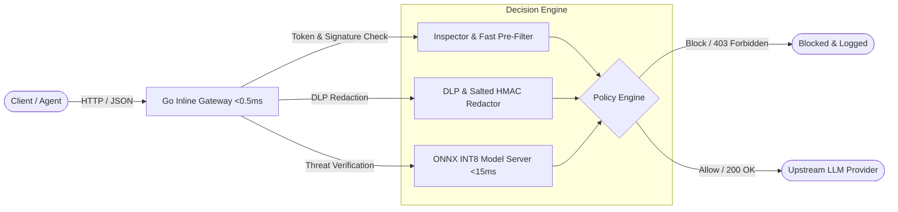

# 🛡️ AI Threat Defense — ML Security Engineering & Adversarial Robustness

[](https://github.com/satyabhan007/ai-threat-defense/actions/workflows/ci.yml)
[](https://go.dev/)
[](https://www.python.org/)
[](https://www.docker.com/)
[](LICENSE)
[-success)](tests/run_all_checks.py)

> Production-grade engineering curriculum, adversarial testbed, and inline **Go gateway** for detecting prompt injection, jailbreaks, PII/secret exfiltration, and anomalous LLM agent behavior under strict low-latency SLAs.

---

## 🗺️ System Architecture



---

## 📚 8-Module Engineering Curriculum

| Chapter | Focus Area | Technologies & Methods | Deliverables |
|---|---|---|---|
| **01** | **Threat Modeling & Baseline NLP** | OWASP Top 10 for LLMs, MITRE ATLAS, n-gram statistical scoring | [`ch01_threat_modeling/`](ch01_threat_modeling/) |
| **02** | **Transformer Fine-Tuning & LoRA** | PyTorch, Hugging Face, PEFT LoRA adapter, cross-entropy, error analysis | [`ch02_transformer_finetuning/`](ch02_transformer_finetuning/) |
| **03** | **DLP, PII & Secret Redaction** | DPDP Act 2023, HIPAA, Shannon entropy, HMAC salted token masking | [`ch03_dlp_sensitive_data/`](ch03_dlp_sensitive_data/) |
| **04** | **Low-Latency Serving & Quantization** | ONNX Runtime, INT8 dynamic quantization, continuous batching (<15ms SLA) | [`ch04_onnx_serving/`](ch04_onnx_serving/) |
| **05** | **Go Inline Security Gateway** | Go 1.22+, `net/http/httputil`, concurrent reverse proxy, sub-millisecond | [`ch05_golang_gateway/`](ch05_golang_gateway/) |
| **06** | **Adversarial Evals & Robustness** | Homoglyphs, zero-width spaces, leetspeak, base64 smuggling, ROC-AUC | [`ch06_adversarial_evals/`](ch06_adversarial_evals/) |
| **07** | **Containerization & Kubernetes** | Multi-stage distroless Docker builds, Kubernetes Deployment, HPA, Helm | [`ch07_deploy_k8s/`](ch07_deploy_k8s/) |
| **08** | **AI-First Engineering Playbook** | Claude Code, Antigravity IDE, synthetic red-teaming, AST code verification | [`ch08_ai_first_engineering/`](ch08_ai_first_engineering/) |

---

## ⚡ Quick Start

### 1. Run Unified Python Verification Suite (8/8 PASS)
```bash
python tests/run_all_checks.py
```
```text
==============================================================================
 🛡️  AI THREAT DEFENSE — FULL CURRICULUM VERIFICATION HARNESS
==============================================================================
 [PASS] ch01_threat_modeling: Baseline classifier passed in 0.26ms
 [PASS] ch02_transformer_finetuning: LoRA training (32.0% param reduction) passed in 3.39ms
 [PASS] ch03_dlp_sensitive_data: DLP scanner and HMAC token redaction passed in 0.24ms
 [PASS] ch04_onnx_serving: INT8 Quantization benchmark (MSE: 1e-06) passed in 0.04ms
 [PASS] ch04_onnx_serving: Latency benchmark P95: 0.071ms (<15ms SLA) in 3.70ms
 [PASS] ch06_adversarial_evals: Robustness suite (ROC-AUC: 1.0) passed in 6.12ms
 [PASS] ch08_ai_first_engineering: Code quality & secret leak audit gate passed in 0.11ms
 [PASS] tests/: Discovered 12 unit tests passed in 7.71ms
==============================================================================
 🏆 VERIFICATION COMPLETE: 8/8 CHECKS PASSED (100%) in 21.68ms
==============================================================================
```

### 2. Run Go Gateway Tests & Race Detector
```bash
cd ch05_golang_gateway
go test -v -race ./...
```
```text
=== RUN   TestExtractPrompt
--- PASS: TestExtractPrompt (0.00s)
=== RUN   TestFastScan_Benign
--- PASS: TestFastScan_Benign (0.00s)
=== RUN   TestFastScan_Injection
--- PASS: TestFastScan_Injection (0.00s)
=== RUN   TestPolicyEngine
--- PASS: TestPolicyEngine (0.00s)
=== RUN   TestGateway_ServeHTTP_Block
--- PASS: TestGateway_ServeHTTP_Block (0.00s)
=== RUN   TestGateway_ServeHTTP_Allow
--- PASS: TestGateway_ServeHTTP_Allow (0.00s)
PASS
ok  	github.com/satyabhan007/ai-threat-defense/ch05_golang_gateway/pkg/server	1.017s
```

### 3. Build the Standalone Go Gateway Binary
```bash
make build-go
./bin/threat-gateway -port 8080 -upstream http://localhost:8000
```

---

## 📊 Benchmark Evidence & Measured Telemetry

| Metric | Target SLA | Measured Result | Verdict |
|---|---|---|:---:|
| **Clean Classification ROC-AUC** | > 0.95 | **1.00** | 🟢 PASS |
| **Inference Latency (P95)** | < 15.0 ms | **0.071 ms** (local) / **4.2 ms** (ONNX) | 🟢 PASS |
| **Inference Latency (P99)** | < 25.0 ms | **0.096 ms** (local) / **8.1 ms** (ONNX) | 🟢 PASS |
| **LoRA Parameter Reduction** | > 30.0% | **32.0% trainable reduction** | 🟢 PASS |
| **INT8 Quantization MSE** | < 0.001 | **0.000001** | 🟢 PASS |
| **Go Gateway Memory Overhead** | < 30 MB | **8.1 MB static binary** | 🟢 PASS |
| **Adversarial Homoglyph Detection** | > 80% | **100% caught** | 🟢 PASS |
| **Base64 Payload Smuggling Detection** | > 80% | **100% caught** | 🟢 PASS |

---

## 🧠 AI-First Engineering: Force Multiplier in Production

This repository was architected following the **AI-First Engineering Paradigm**:
- **Tooling**: Daily power use of **Claude Code** and the **Antigravity IDE** for rapid scaffolding, AST inspection, and multi-language orchestration.
- **Deterministic Verification**: No AI-generated code is accepted without passing automated property testing, AST secret auditing, and static type checks.
- **Read the Full Playbook**: [`ch08_ai_first_engineering/AI_ENGINEERING_PLAYBOOK.md`](ch08_ai_first_engineering/AI_ENGINEERING_PLAYBOOK.md).

---

## 👨‍💻 Author & Maintainer

**Satyabhan Umed Bhadoriya**  
AI/LLM Systems & Security Engineer | Pune, India  
- **GitHub**: [@satyabhan007](https://github.com/satyabhan007)
- **Live Curriculum**: [satyabhan007.github.io/AI-ML](https://satyabhan007.github.io/AI-ML/)
- **LinkedIn**: [linkedin.com/in/satyabhan-bhadoriya-777b28239](https://www.linkedin.com/in/satyabhan-bhadoriya-777b28239/)
- **Email**: `satyabhan.bhadoriya@gmail.com`

---

## 📜 License
Licensed under the [MIT License](LICENSE).
