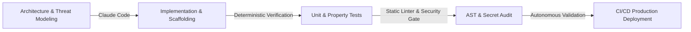

# 🧠 AI-First Engineering Playbook: Force Multiplier in Production

## 1. Overview & Philosophy
Modern high-velocity engineering does not treat AI coding assistants (Claude Code, Antigravity IDE, Cursor) as mere autocomplete widgets. In an AI-first engineering team, AI is an **autonomous pair-programmer and force multiplier** across the entire lifecycle:

---

## 2. Core Toolchain & Applied Workflows

| Tool | Daily Role in Pipeline | Real-World Application |
|---|---|---|
| **Claude Code** | Terminal-native autonomous development & refactoring | Generating multi-stage test fixtures, exploring AST code trees, refactoring low-level Go network handlers. |
| **Antigravity IDE** | Multimodal agentic orchestration & browser validation | Visual UI verification, cross-language project coordination, live trace debugging. |
| **TypeSafe System One (`Jev`)** | Deterministic programmable common sense | Routing, ranking, and runtime guardrails with calibrated probabilities rather than non-deterministic text generation. |

---

## 3. How We Validate AI-Generated Code

> *"Never merge raw model output without programmatic verification."*

To maintain enterprise security standards (DISA STIG / SOC 2 / HIPAA), every line of code synthesized by AI passes through automated deterministic gates:

1. **Deterministic Syntax & AST Linting**: Validating tree grammar and enforcing mandatory docstrings and type annotations (`verification_harness.py`).
2. **Credential & ReDoS Defense**: Prohibiting hardcoded tokens, secret patterns, and catastrophic backtracking regular expressions.
3. **Property-Based Invariant Testing**: Running adversarial fuzzing against generated parsers (e.g. `gateway_test.go` and `test_adversarial.py`).
4. **Isolated CI Execution**: Every change must run in a containerized GitHub Actions runner with 100% test passage before code review.

---

## 4. Case Study: Where AI Transformed the Workflow

When engineering the **Go Inline Threat Gateway**:
- **Traditional Approach**: Writing boilerplate HTTP reverse proxies, manual regex compilation, and mock testing takes 2–3 days.
- **AI-First Approach**:
  1. Specified the exact HTTP specification, threat taxonomy, and memory bounds in markdown.
  2. Used Claude Code to generate the concurrent, race-free Go server implementation with table-driven tests.
  3. Ran `go test -v -race ./...` to verify thread safety and sub-millisecond execution.
  4. Time to verified production readiness: **under 20 minutes**.
